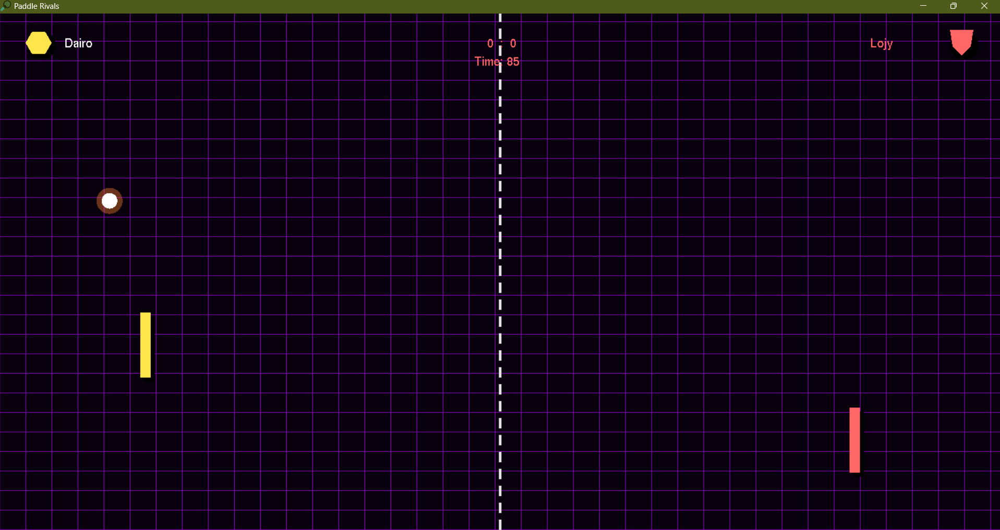
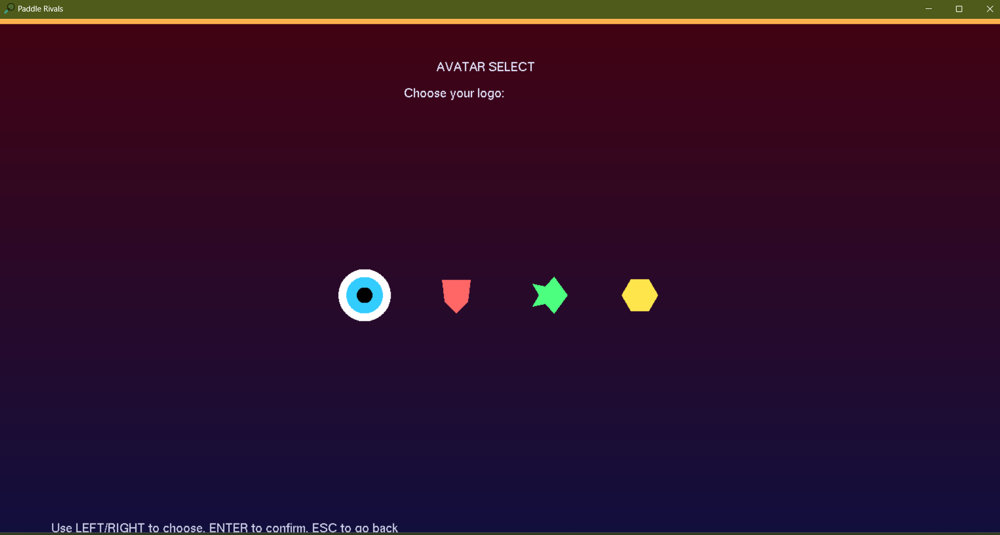
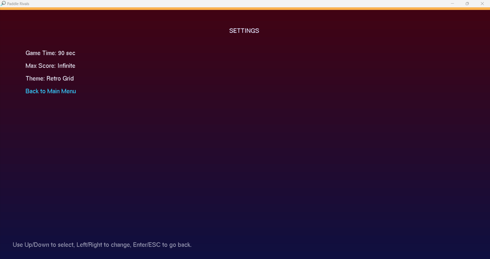

# 🎮 **Paddle Rivals – The Ultimate Arcade Showdown**

<p align="center">
  
</p>

<p align="center">
  <b>⚡ Neon. ⚔️ Rivalry. 🕹️ Precision.</b><br>
  A modern OpenGL-powered Pong remake with dynamic menus, AI opponents, FX, and theme customization.
</p>

---

## 🚀 Overview

**Paddle Rivals** is a fast‑paced, modernized Pong experience built in **C++ & OpenGL (FreeGLUT)**.  
With flashy visuals, smooth gameplay, dynamic themes, full menu navigation, AI opponents, and 3D elements — this game levels up the classic arcade duel.

---

## ⭐ Key Features

### 🎮 Gameplay
- ⚔️ **Single Player Mode** with AI (Easy / Medium / Hard)
- 🤝 **Multiplayer 1v1 Mode**
- 🧭 Smooth 4-direction paddle movement
- 🏐 Dynamic ball physics with speed scaling
- 💥 Scoring flash & screen-shake FX
- 🔄 Pause menu, resume, restart, return to menu

### 🧠 AI Opponent
- Tracks ball movement
- Reacts based on difficulty
- Moves horizontally & vertically
- Responsive with no jitter

### 🎨 Visual Themes
Three selectable themes:
- 🌃 **Neon Night**
- 🌌 **Cosmic Field**
- 🕹️ **Retro Grid** *(default)*

Includes:
- 3D rotating cube in menus
- Ball glow effects
- Themed gradients
- Modern HUD and avatars

### 🔊 Audio & Polish
- Looping background music
- Custom window icon
- Immersive fake‑fullscreen mode

---

## 📂 Project Structure

```
Paddle-Rivals/
│
├── Assets/
│   ├── logo.png
│   ├── icon.ico
│   ├── bg_music.wav
│   └── screenshots/
│
├── Demo_Video/
│   └── demo.mp4
│
├── main.cpp
└── README.md
```

---

## 🎥 Demo & Screenshots

### 📹 Full Gameplay Demo  
[▶️ Click Here to Watch](assets/demo_Video/demo_video.mp4)

---

### 🖼️ Screenshots

| Main Menu | Gameplay |
|----------|----------|
|  |  |

| Avatar Select | Settings |
|----------|----------|
|  |  |

---

## 🎮 Controls

### Single Player
| Action | Keys |
|--------|------|
| Move | W / A / S / D or Arrow Keys |
| Pause | ESC |

### Multiplayer
| Player | Up | Down | Left | Right |
|--------|-----|-------|--------|--------|
| **P1** | W | S | A | D |
| **P2** | ↑ | ↓ | ← | → |

---

## ⚙️ Build Instructions (Windows – CodeBlocks)

### 1️⃣ Install Dependencies
Install **freeglut** and ensure the following DLLs/libs:
```
freeglut.dll
freeglut.lib
opengl32.lib
glu32.lib
```

### 2️⃣ Link Libraries  
In CodeBlocks → Build Options → Linker Settings:
```
-lfreeglut
-lopengl32
-lglu32
```

Place `freeglut.dll` inside your `bin/Debug` folder.

---

## 🖼️ Add Custom Game Icon

```cpp
#ifdef _WIN32
HANDLE hIcon = LoadImage(NULL, "Assets/icon.ico", IMAGE_ICON, 32, 32, LR_LOADFROMFILE);
SendMessage(GetActiveWindow(), WM_SETICON, ICON_SMALL, (LPARAM)hIcon);
SendMessage(GetActiveWindow(), WM_SETICON, ICON_BIG, (LPARAM)hIcon);
#endif
```

---

## 👑 Credits

**Developed by:**  
- **Mohamed Abdallah Eldairouty (@MohamedEldairouty)**  

**Course:**  
Computer Graphics – AAST 2025

---

## 📝 License
This project is for academic & portfolio use only.  
© 2025 Paddle Rivals Team.
